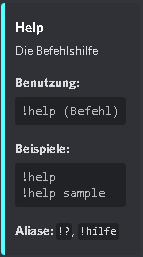
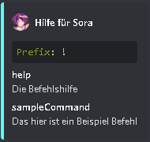

# Python Command System
<a href="https://github.com/404kuso/Discord.py-command-system/blob/main/README.md">
    

[SlashCommand Branch](https://github.com/404kuso/Discord.py-command-system/tree/slash)


## wIe FuNkTiOnIeRt DaS??

### Setup

Bevor überhaupt etwas funktioniert, musst du erstmal einen Bot erstellen auf [der Discord Developers Seite](https://discord.com/developers)

Dort machst du dann alles was du brauchst, lädst den Bot auf einen Server ein und kopierst dann das Token

Das Token fügst du dann in `config.py` bei `token = ""` zwischen die `"` ein.


### Übersicht über den Bot

Alle Befehle sind in dem `/commands/` Ordner


Der Bot reagiert auf das Prefix in [`config.py`](./config.py) und auf den Benutzer Ping (@Bot)

Ein Befehl ist wie folgt aufgebaut:

```python
async def main(message, args, client):
    # Command code hier
name = "Command Name"
desc = "Die Beschreibung vom Befehl"
usage = "Die (Benutzung) [von dem Command]"
examples = ["Beispiel1", "Beispiel2"]
alias = ["commandAlias", "commandAlias2"]
```

Für mehr Infos, einfach [`/commands/sample.py`](./commands/sample.py) angucken


### Befehl erstellen per Command Line

Man kann jetzt einen Befehl einfach erstellen in CMD/Powershell/Terminal:


Im root ordner von dem Github Projekt hier folgende Befehle eingeben

```cmd
cd tools
python createCommand.py
```

Dann einfach den Anweisungen folgen und eine Datei wird in `/commands/` erstellt

Die Datei enthält dann alles was man braucht.

`pass` dann einfach wegmachen und durch den Command Code ersetzen


__Beispiel:__

**Der erstellte Befehl**
```python
from typing import List
import discord

async def main(message: discord.Message, args: List[str], client: discord.Client):
    pass

name = "sampleCommand"                                          # Name
desc = "This is a Sample Command"                               # Beschreibung
alias = ["sc"]                                                  # Alias
usage = "sampleCommand"                                         # Benutzung
examples = ["sc"]                                               # Beispiele
```

**zu**

```python
from typing import List
import discord

async def main(message: discord.Message, args: List[str], client: discord.Client):
    print("command aufgerufen")

name = "sampleCommand"                                          # Name
desc = "This is a Sample Command"                               # Beschreibung
alias = ["sc"]                                                  # Alias
usage = "sampleCommand"                                         # Benutzung
examples = ["sc"]                                               # Beispiele
```


Den Bot kann etweder mit `python index.py` gestartet werden oder mit `/tools/run.bat`


## Help command

Ein _help_ Befehl ist schon erstellt

Mit  `help Befehl` werden die Infos über einen Befehl gesendet




Mit `help` werden dann einfach alle Befehle angezeigt



## Wie der Hase läuft

Das meiste findet in `/modules/botCommands.py` statt. Dort wird einfach durch jede Datei im `/commands/` Ordner durchgeguckt.
Es wird dann überprüft, ob der Command Name dem entspricht was gesendet wurde, oder ob das was gesendet wurde in den Aliasen
von einem Befehl enthalten ist. Wenn ja, wird dann die `main` Funktion aufgerufen und der Code ausgeführt.


## Dateien/Ordner Erklärung

### [`/`](./)

Der Ordner in dem das hier alles drinnen ist

#### [`index.py`](./index.py)

Die Datei in dem der Hauptcode vom Bot ist, der zuallererst ausgeführt wird und alles regelt

#### [`config.py`](./config.py)

Hier sind alle Einstellungen wie die Farbe der Embeds, der Prefix und der Token drinnen

#### [`README.md`](./README.md)

Das ist das hier was du gerade liest. Diese Datei ist auch nicht relevant für den Bot, sie ist nur für Github wichtig

### [`/commands/`](./commands/)

Das hier ist der Ordner mit den Befehlsdateien. Hier dürfen **nur** Dateien bei denen das Befehlsformat ist drinnen sein

### [`/docs/`](./docs/)

Das ist nur ein Ordner für Github mit Zeugs wie Bildern, etc. drinnen, der ist nicht für den Bot relevant, der kann gelöscht werden


###  [`/modules/`](./modules/)

Hier sind alle Module drinnen, die genutzt werden sollen/können

Der Ordner ist einfach nur zur Übersicht da, damit der root Ordner nicht vollgefüllt ist mit irgendwelchen python Modulen

#### [`botCommands.py`](./modules/botCommands.py)

Das ist die Datei, die die Befehle verarbeitet, sucht und so. Die Datei ist **wichtig** für den Bot, daher nicht löschen solange kein anderes Commandsystem vorliegt
