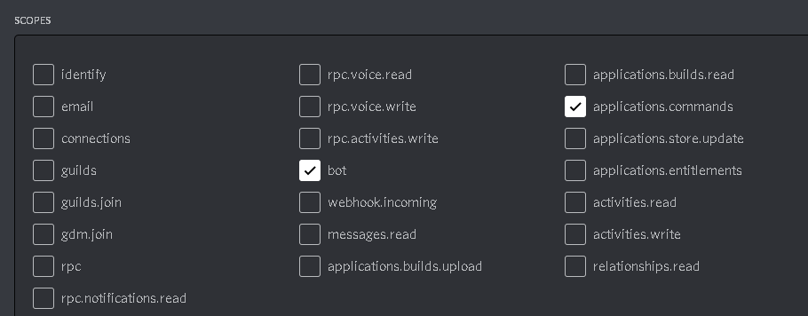

# Python Command System
<a href="https://github.com/404kuso/Discord.py-command-system/blob/main/README.md">
    

## wIe FuNkTiOnIeRt DaS??

### Setup

Bevor überhaupt etwas funktioniert, musst du erstmal einen Bot erstellen auf [der Discord Developer Seite](https://discord.com/developers)

Dort machst du dann alles was du brauchst, lädst den Bot auf einen Server ein und kopierst dann das Token

**Hinweis**

Damit der Bot SlashCommands nutzen können, muss bei dem OAuth2 Link `Bot` und `application.commands` ausgewählt sein


Das Token fügst du dann in `config.py` bei `token = ""` zwischen die `"` ein.


### Übersicht über den Bot

Alle Befehle sind in dem `/commands/` Ordner


Ein Befehl ist wie folgt aufgebaut:

```python
import discord
from discord.ext import commands
from discord_slash import SlashCommand, SlashContext

def register(client: commands.Bot):
    slash: SlashCommand = client.slash
    @slash.subcommand(base='bot', name="test", description="Testet den Bot")
    async def command(ctx: SlashContext):
        pass
```

Für mehr Infos, einfach [`/commands/sample.py`](./commands/sample.py) angucken


### Befehl erstellen per Command Line

Man kann jetzt einen Befehl einfach erstellen in CMD/Powershell/Terminal:


Im root ordner von dem Github Projekt hier folgende Befehle eingeben

```cmd
cd tools
python createCommand.py
```

Dann einfach den Anweisungen folgen und eine Datei wird in `/commands/` erstellt

Die Datei enthält dann alles was man braucht.

`pass` dann einfach wegmachen und durch den Command Code ersetzen

Den Bot kann etweder mit `python index.py` gestartet werden oder mit `/tools/run.bat`


## Wie der Hase läuft

Das meiste findet in `index.py` statt. Es wird bevor der Bot richtig "gestartet" wird, einmal durch jeden command in `/commands/` durchgeangen und dieser wird dann als SlashCommand für den Bot registriert.


## Dateien/Ordner Erklärung

### [`/`](./)

Der Ordner in dem das hier alles drinnen ist

#### [`index.py`](./index.py)

Die Datei in dem der Hauptcode vom Bot ist, der zuallererst ausgeführt wird und alles regelt

#### [`config.py`](./config.py)

Hier sind alle Einstellungen wie die Farbe der Embeds, der Prefix und der Token drinnen

#### [`README.md`](./README.md)

Das ist das hier was du gerade liest. Diese Datei ist auch nicht relevant für den Bot, sie ist nur für Github wichtig

### [`/commands/`](./commands/)

Das hier ist der Ordner mit den Befehlsdateien. Hier dürfen **nur** Dateien bei denen das Befehlsformat ist drinnen sein

### [`/docs/`](./docs/)

Das ist nur ein Ordner für Github mit Zeugs wie Bildern, etc. drinnen, der ist nicht für den Bot relevant, der kann gelöscht werden
